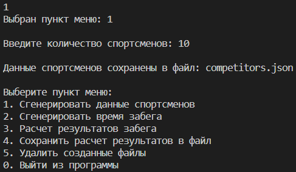
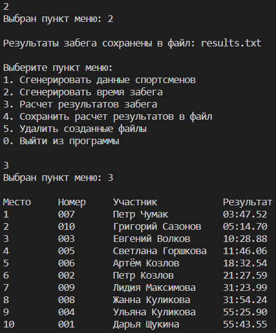
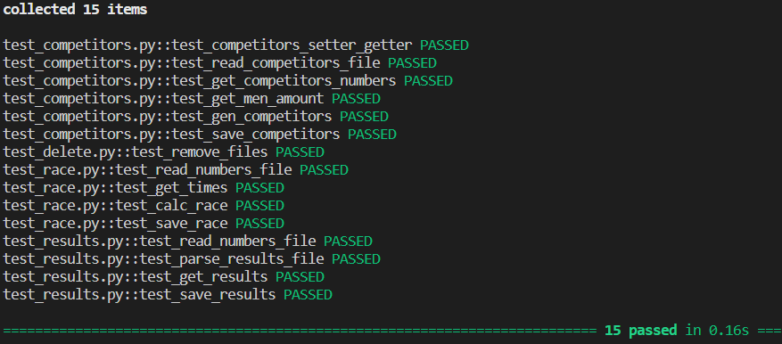

# Приложение "Бегуны"

https://github.com/InAnotherLife/runners

https://t.me/JohnWooooo

[](https://github.com/InAnotherLife/runners/actions/workflows/main.yml)

## О проекте
Приложение "Бегуны" позволяет сгенерировать информацию о спортсменах и времени забега, посчитать и сохранить в файл итоговую таблицу результатов забега.\
Приложение разработано на языке Python версии 3.9. Код программы находится в папке src. Приложение имеет консольный интерфейс.\
Код покрыт тестами. Для написания тестов использовался фреймворк Pytest.

## Стек
* Python 3.9
* Паттерн Facade

## Запуск приложения
Для запуска приложения установка дополнительных зависимостей не требуется.\
Необходимо перейти в папку src и выполнить команду:
```
python main.py
```

## Меню приложения


Чтобы сгенерировать данные спортсменов, необходимо выбрать пункт меню 1. Далее нужно ввести количество спортсменов.



Для генерации времени забега и для расчета результатов забега необходимо последовательно выбрать пункты меню 2 и 3.



Можно сохранить результаты расчета в файл (пункт меню 4) или удалить созданные файлы (пункт меню 5).

## Запуск тестов
Для запуска тестов необходимо перейти в папку src и выполнить команду:
```
pytest
```

