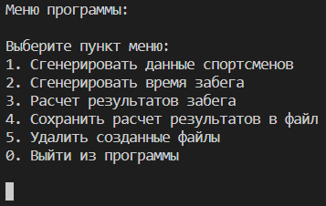

# Приложение "Бегуны"

https://github.com/InAnotherLife/runners

https://t.me/JohnWooooo

[](https://github.com/InAnotherLife/runners/actions/workflows/main.yml)

## О проекте
Приложение "Бегуны" разработано на языке Python версии 3.9. Код программы находится в папке src.\
Приложение имеет консольный интерфейс.

## Стек
* Python 3.9
* Паттерн Facade

## Запуск приложения
Для запуска приложения установка дополнительных зависимостей не требуется.\
Необходимо перейти в папку src и выполнить команду:
```
python main.py
```
Установка дополнительный зависимостей не требуется.

## Меню приложения


